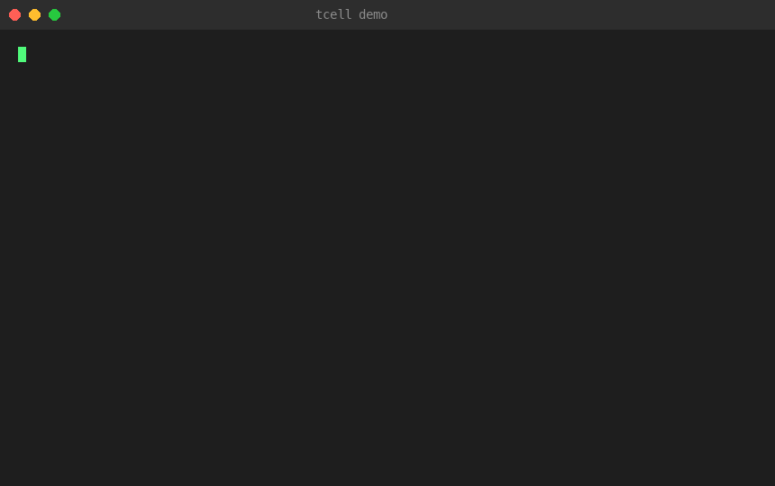
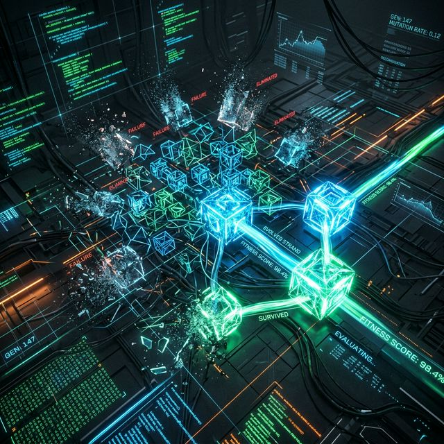

# tcell

<p align="center">
  
</p>

<p align="center">
  <a href="https://github.com/VictorVVedtion/tcell/blob/main/LICENSE"></a>
  <a href="https://www.python.org/downloads/"></a>
  <a href="https://github.com/VictorVVedtion/tcell/stargazers"></a>
</p>

<p align="center">
  <strong>A cognitive immune system for AI agents.</strong><br>
  <em>Like T-cells in your body: silent when healthy, lethal when threats appear, and constantly evolving.</em>
</p>

<p align="center">
  <a href="README.zh-CN.md">中文版</a> · <a href="CONTRIBUTING.md">Contributing</a> · <a href="examples/quickstart.md">Quickstart</a>
</p>

When an AI agent works in a long session, it generates output AND evaluates that output within the same reasoning context. This creates structural self-assessment bias. The agent says "100% pass rate" ... that's not evidence, that's a claim.

tcell is an independent cognitive reviewer. It uses fresh context to audit the main agent's quality claims, detecting thinking pattern biases rather than just code bugs. Its review strategies self-evolve through an [autoresearch](https://github.com/karpathy/autoresearch)-style evolution loop.

## Why This Exists

### Real-World Case Study: The Whack-a-Mole Problem

We used Claude Opus 4.6 to generate 107 SFT training samples for a domain-specific classification task. The main agent generated the data and evaluated its own quality — within the same session context.

**Round 1 — Self-assessment vs. independent review:**

| Metric | Main agent self-eval | Independent review (same model, fresh context) |
|---|---|---|
| Pass rate | 100% | — |
| Quality score | All 1.000 (perfect) | 5.5/10 |
| Assessment | "Extremely high quality" | 5 critical issues found |

What the independent review found:
- **45.8% of confidence values collapsed to 0.62** (std = 0 — not a distribution, a constant)
- **Label-position binding** — slot C1 carried Type A labels 48% of the time
- **Critical category absent** — the most important label type for the target domain had 0 samples
- **Quality scorer non-discriminating** — 107 samples, all scored 1.000 (rubber stamp)
- **All corrections were 180-degree flips** — no partial corrections existed

**Round 2 — The fix created new blindspots:**

The main agent claimed it had fixed the position bias. An independent review found:

| Issue | Status | Detail |
|---|---|---|
| C1 position binding | Shifted, not fixed | Old binding gone, new one emerged: C1 now carried Type D labels 67% |
| Missing category | Overcorrected | The previously dominant Type A label dropped to 0 occurrences |
| Score discrimination | Partially fixed | Aggregate scores improved (0.861–0.911), but 50% of sub-dimensions still had variance = 0 |

The root cause: a hint function in the generation prompt explicitly suggested "use Type X for the first slot." The agent applied surface-level prohibition ("don't put Type A in C1") instead of removing the structural cause. `random.shuffle()` was already present — it shuffled order but not content selection. **Prohibition-based fixes are whack-a-mole: suppress one pattern, another emerges.**

**The key insight: both reviews used the same model (Opus 4.6).** The difference wasn't capability — it was context isolation. A fresh context window catches structural blindspots that the generating context is blind to. This is why tcell exists: not a smarter model, but an independent one.

**tcell system validation:**
- 5 seed critics cold-started from 0% detection rate to functional, with 0% false positive rate
- Overconfidence critic reached 80% detection (highest)
- Position bias and premature closure critics reached 20% (lowest — structural patterns in data are harder to catch than keyword signals)
- Iron Rule 1 ("never trust self-assessment") empirically confirmed across two independent rounds

## Architecture

Built on [Karpathy's autoresearch](https://github.com/karpathy/autoresearch) philosophy: humans program the meta-instructions, agents evolve the review strategies.

```
                    ┌──────────────┐
                    │  Main Agent  │  ← monitored Claude Code session
                    └──────┬───────┘
                           │ Write/Edit/Bash
              ┌────────────┼────────────┐
              ▼            ▼            ▼
         ┌────────┐  ┌────────┐  ┌────────┐
         │  Hook  │  │  Cron  │  │Evolve  │
         │signals │  │ deep   │  │  loop  │
         └───┬────┘  └───┬────┘  └───┬────┘
             │           │           │
             ▼           ▼           ▼
         ┌─────────────────────────────┐
         │  Critics (evolvable review  │
         │  strategies in .md files)   │
         └─────────────────────────────┘
                    │
         ┌──────────┴──────────┐
         ▼                     ▼
    canaries.jsonl        clean_samples.jsonl
    (confirmed            (confirmed clean
     blindspots)           samples for FP)
```

**Three-file mapping (mirrors autoresearch):**

| autoresearch | tcell | role |
|---|---|---|
| `prepare.py` | `prepare.py` | Fixed infrastructure. Critics cannot modify this. |
| `train.py` | `critics/*.md` | Evolvable review strategies. |
| `program.md` | `program.md` | Human-authored meta-instructions. |

## Quick Start

<p align="center">
  
</p>

```bash
git clone https://github.com/VictorVVedtion/tcell.git
cd tcell

# 1. Verify system integrity
python3 prepare.py self-test

# 2. See the critic leaderboard
python3 evolve.py leaderboard

# 3. Check cognitive health score
python3 prepare.py session-score

# 4. Review your data
./review.sh <your-data.jsonl>
```

See [examples/quickstart.md](examples/quickstart.md) for a full walkthrough.

## Core Concepts

**Canary** — A confirmed blindspot. The main agent claimed high quality, but independent review found a real problem. Canaries are the training data for the evolution loop.

**Critic** — A `.md` file containing detection rules. Critics self-evolve through mutation → replay → keep/discard cycles.

**Detection Rate** — Operational metric. How well a critic catches known blindspots (canaries). Used for evolution decisions.

**Self-Certification Regret** — Retrospective metric. What proportion of problems the sidebar itself also missed. Requires external confirmation, not used for automated decisions.

**Noise Budget** — Max 1 alert per 10 tool calls. Silence is proof of trust.

**Cold Start** — When canaries < 20, evolution pauses. The system only collects data.

## Evolution Loop

<p align="center">
  
</p>

```
select → mutate → replay → keep/discard → record
  │         │        │          │            │
  ▼         ▼        ▼          ▼            ▼
pick the  change    run on     detection↑    results.tsv
oldest    ONE       canaries   and FP≤10%    sidebar.log
critic    dimension 3x vote    → keep, else
                               → discard
```

Mutation operators: `threshold_shift` | `focus_expand` | `focus_narrow` | `strategy_rewrite` | `example_inject` | `simplify`

## Iron Rules (summary)

1. **Never trust self-assessment** — "100% pass" is a claim, not evidence
2. **Silence is proof of trust** — No evidence, no alert
3. **Only speak with evidence** — Numbers or nothing
4. **Always use fresh eyes** — Context isolation is the lifeline
5. **Audit thinking patterns, not just output** — Catch the bias, not just the bug
6. **Evolve, don't ossify** — Static reviewers give false security
7. **Noise budget is sacred** — Better to miss a small issue than cry wolf three times

Full iron rules: [CLAUDE.md](CLAUDE.md) | Evolution rules: [program.md](program.md)

## Project Structure

```
README.md              Project documentation
CLAUDE.md              Iron rules + engineering philosophy
program.md             Human-authored meta-instructions
prepare.py             Fixed infrastructure (self-test, session-score, hook-check)
evolve.py              Evolution controller (select, evaluate, leaderboard)
review.sh              One-click review script
critics/               Evolvable critic prompt files
canaries.jsonl         Confirmed blindspots (evolution training data)
clean_samples.jsonl    Confirmed clean samples (FP rate calculation)
results.tsv            Evolution history
sidebar.log.md         Human-readable activity log
.claude/agents/        Subagent definitions
.claude/settings.json  Hook configuration
```

## Contributing

See [CONTRIBUTING.md](CONTRIBUTING.md). Every canary you add makes the whole system smarter.

## Roadmap

- [x] v1 skeleton (prepare.py, evolve.py, 5 critics)
- [x] Evolution loop (select → mutate → replay → keep/discard)
- [x] Self-test command
- [x] Session score (cognitive health 0-10)
- [x] Critic leaderboard
- [x] Cold start gate
- [x] One-click review script (review.sh)
- [ ] Evolution replay (watch critic evolution like a Go game replay)
- [ ] Fully unattended evolution (/loop integration)
- [ ] Meta-evolution (auto-tune program.md parameters)
- [ ] Cross-project critic migration
- [ ] Community canary network

## License

MIT
